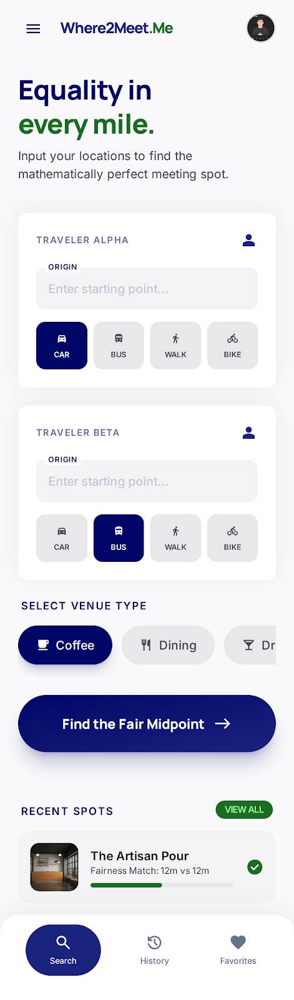
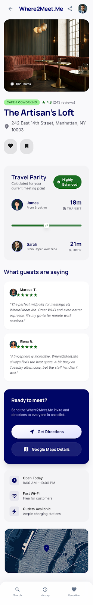
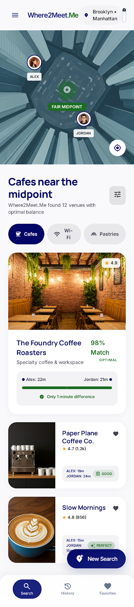
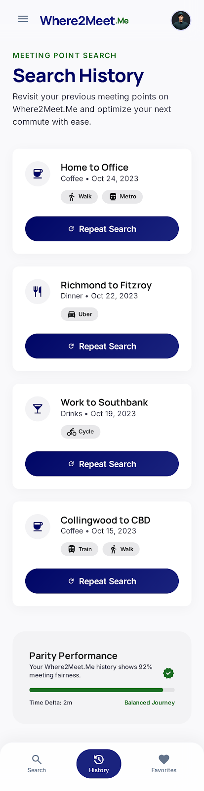

# Design System Reference — "The Objective Concierge"

These are the original design prototypes generated with [Google Stitch](https://stitch.withgoogle.com/) that serve as the visual foundation for Where2Meet.Me. Each folder contains a screenshot (`screen.png`) and the exported HTML prototype (`code.html`) that can be opened directly in a browser.

The full design system specification is in [DESIGN.md](DESIGN.md).

---

## Screens

### v1-home — Home / Search Screen

The primary input screen. Features:
- **"Equality in every mile"** hero headline (Manrope display-lg)
- Traveler Alpha / Beta input cards with origin fields and travel mode chips (Car, Bus, Walk, Bike)
- Venue type selector pills (Coffee, Dining, Drinks)
- **"Find the Fair Midpoint"** gradient CTA button
- Recent spots card with parity preview
- Bottom navigation bar (Search, History, Favourites)

**What we changed for Where2Meet.Me:**
- Expanded from 2 fixed travelers to a dynamic 2-6 traveler list with "+ Add person" button
- Made traveler names editable (tap to rename "Traveler Alpha" to "Alex")
- Added "Send invite link" as an alternative to manual entry
- Replaced Favourites tab with Plans (V2 placeholder)

---

### v1-details — Venue Detail Screen

The venue detail view when a user taps a result. Features:
- Full-width photo hero with venue name overlay
- Star rating, review count, address
- **Travel Parity** card showing travel times for both travelers
- "What guests are saying" review snippets
- "Ready to meet?" action card with Google Maps deep links
- Directions and details CTAs

**What we changed for Where2Meet.Me:**
- Simplified — removed inline review snippets (link out to Google Maps instead)
- Made **"Share this spot"** the primary CTA (above "Get Directions")
- Parity card scales to show N traveler bars instead of just 2
- Added "View on Google Maps" link for full venue details

---

### v2-results — Results / Map Screen

The search results view after midpoint calculation. Features:
- Stylised map section with origin markers and midpoint indicator
- **"Cafes near the midpoint"** header with venue count
- Filter chips (Cafes, Wi-Fi, Pastries)
- Venue cards in mixed layouts:
  - Full-width hero card (top result with "98% Match" badge)
  - Horizontal split cards with fairness labels ("Good", "Perfect")
- Fairness balance meter on each card
- "New Search" FAB button

**What we changed for Where2Meet.Me:**
- Interactive Mapbox GL map replacing the static illustration
- N origin markers (up to 6) with name labels
- Multi-person Parity Meter (horizontal bars per person, colour-coded green/yellow/red)
- **Share FAB** is now more prominent than "New Search" — sharing is the primary post-result action
- Fairness score shown as percentage with label (Perfect/Great/Good/Fair)

---

### v3-history — Search History Screen

The search history view (V2 feature). Features:
- "Search History" header with descriptive subtitle
- Past search cards showing origin pair, date, venue type
- "Repeat Search" action buttons
- "Parity Performance" stats section at the bottom

**What we changed for Where2Meet.Me:**
- Deferred to V2 (requires user accounts/auth)
- For MVP, a lightweight "recent spots" section on the home screen uses local storage instead

---

## Design System Summary

The full specification is in [DESIGN.md](DESIGN.md). Quick reference:

| Token | Value | Usage |
|-------|-------|-------|
| `primary` | `#000666` | Deep Navy — buttons, links, header |
| `primary-container` | `#1a237e` | Gradient endpoint for CTAs |
| `secondary` | `#1b6d24` | Fairness Green — balance indicators only |
| `surface` | `#f9f9fb` | Page background |
| `surface-container-low` | `#f3f3f5` | Input fields, secondary sections |
| `surface-container-lowest` | `#ffffff` | Cards, interactive elements |
| `surface-container-high` | `#e8e8ea` | Unselected chips, elevated overlays |
| `on-surface` | `#1a1c1d` | Primary text (never pure black) |
| `on-surface-variant` | `#44474a` | Secondary text, metadata |
| `outline-variant` | `#c6c5d4` | Ghost borders (15% opacity only) |

### Typography

| Role | Font | Weight | Size |
|------|------|--------|------|
| Display | Manrope | 800 | 3.5rem |
| Headline | Manrope | 700 | 1.5-2rem |
| Title | Inter | 600 | 1.125rem |
| Body | Inter | 400 | 0.875rem |
| Label | Inter | 500 | 0.75rem |

### Key Rules

1. **No-Line Rule** — zero 1px borders; boundaries via background colour shifts only
2. **Tonal Layering** — elevation through luminance changes, not shadows
3. **Glassmorphism** — `backdrop-filter: blur(20px)` for floating elements over maps
4. **Gradient CTAs** — `linear-gradient(135deg, #000666, #1a237e)` on primary buttons
5. **Ambient Shadows** — blur 32px, 6% opacity, tinted (not black)
6. **Ghost Borders** — `outline-variant` at 15% opacity, only when needed for accessibility
7. **Fairness Green** — used exclusively for travel-time balance indicators
